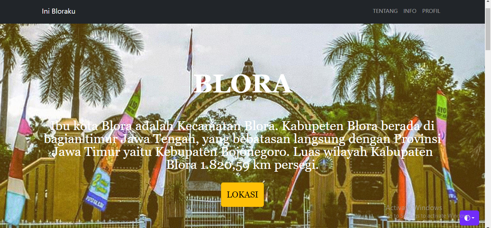
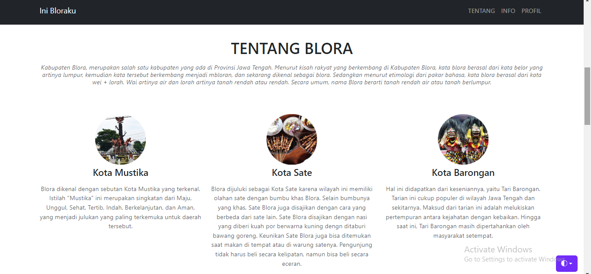
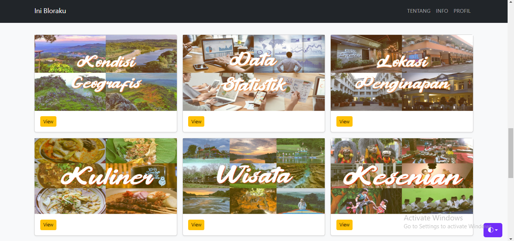
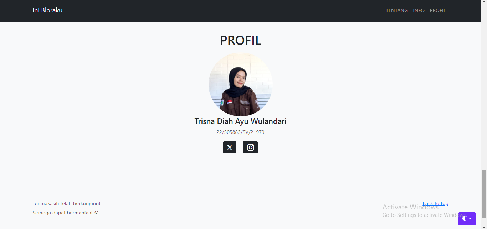

# pgweb_responsi
Nama: Trisna Diah Ayu Wulandari

Deskripsi produk :    
Blora adalah sebuah kabupaten yang terletak di Provinsi Jawa Tengah, Indonesia. Kabupaten ini memiliki luas wilayah sekitar 1.820,95 kilometer persegi dan pada tahun 2020, jumlah penduduknya mencapai lebih dari satu juta orang. Pembuatan WebGIs "Ini Bloraku" bertujua untuk mengenalkan kepada masyarakat luas mengenai kabupaten Blora.

Komponen pembangun :   
1. Data shapefile administrasi Kecamatan.
2. Data statistik luas kecamatan, jumlah penduduk, jumlah fasilitas kesehatan, kondisi jalan, dan jumlah koprasi.
3. Data persebaran lokasi penginapan di Kabupaten blora

Sumber data:   
1. https://tanahair.indonesia.go.id/
2. https://blorakab.bps.go.id/
3. https://www.blorakab.go.id/

Tangkapan layar komponen:   
   
   
  
  